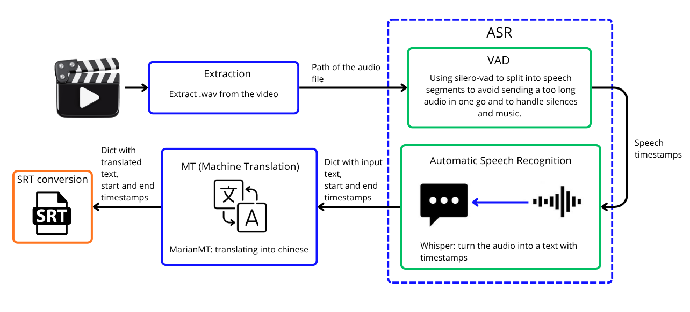

# Subtitles Generator

**A simple AI-based tool to generate translated subtitles to any video.**

---

## Overview

This project extracts speech from a video's audio track, transcribes it, and translates the result into another language, producing subtitles ready to use. It was originally built around a French → Chinese translation use case (e.g. subtitling French movies for a Chinese-speaking audience), but it now supports translation from and into the following languages:

- English
- French
- Chinese (simplified)
- Spanish
- German
- Italian
- Japanese
- Korean
- Russian
- Arabic
- Portuguese

---

## Getting Started

1. Clone the repository, or download it as a ZIP and extract it:

   ```bash
   git clone https://github.com/<your-username>/subtitles-generator.git
   cd subtitles-generator
   ```

2. Double-click `setup.bat`. This will download all the required libraries and dependencies into a virtual environment. It can take a few minutes to complete.

3. Launch `Subtitles Generator.bat`. This can take a few minutes the first time, and only a few seconds on subsequent launches.

4. Locate the video you wish to get the subtitles from.

5. Indicate the language of the video in "Input language", and indicate which language you want for the subtitles with "Output language".

6. Click on "Generate Subtitles" and choose the path and the name you want for your `.srt` file. The creation of the subtitles can take a few minutes, and can take longer depending on the length of your video.

---

## System Architecture



---

## Pipeline

1. **Speech transcription** — the audio is transcribed with [faster-whisper](https://github.com/SYSTRAN/faster-whisper), using its built-in Silero VAD (`vad_filter=True`) to skip silences and avoid hallucinated text on non-speech segments.
2. **Subtitle segmentation** — word-level timestamps are used to re-chunk the transcription into subtitle-sized segments (bounded by character count and duration, splitting preferably on punctuation) rather than raw VAD segments, which are often too long to be readable as subtitles.
3. **Translation** — each subtitle segment is translated using [NLLB-200 (distilled 600M)](https://huggingface.co/facebook/nllb-200-distilled-600M).
4. **Output** — timestamped, translated subtitle segments, ready to be exported (e.g. to `.srt`) or burned into the video.

## Tech Stack

- **Transcription**: faster-whisper (CTranslate2 backend, `int8` quantization for CPU inference)
- **VAD**: Silero VAD (used internally by faster-whisper)
- **Translation**: facebook/nllb-200-distilled-600M (via `transformers`)
- **Language**: Python
